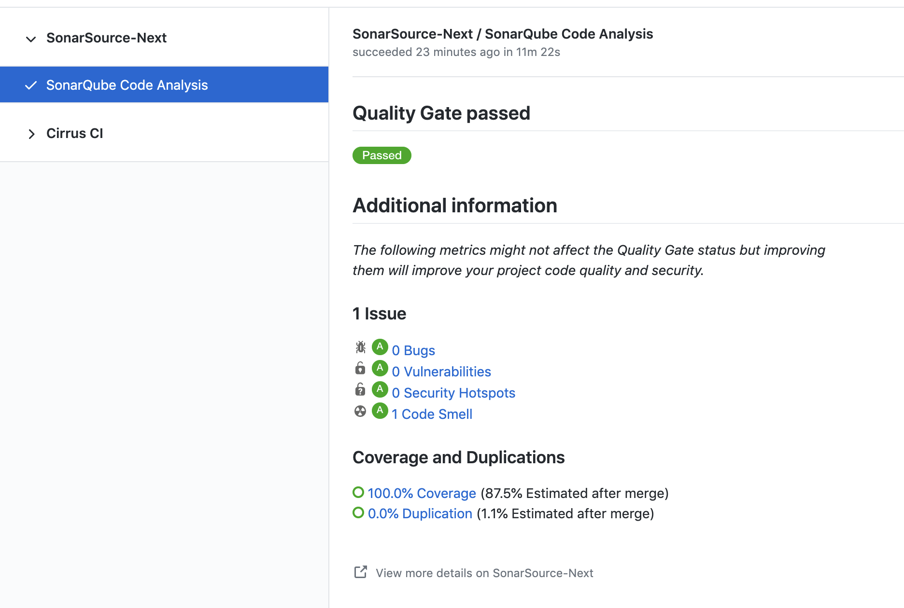

# Scan your code with SonarQube [](https://github.com/SonarSource/sonarqube-scan-action/actions/workflows/qa.yml)

Using this GitHub Action, scan your code with [SonarQube](https://www.sonarqube.org/) to detects Bugs, Vulnerabilities and Code Smells in up to 27 programming languages!


SonarQube is the leading product for Continuous Code Quality & Code Security. It supports most popular programming languages, including Java, JavaScript, TypeScript, C#, Python, C, C++, and many more.

## Requirements

The repository to analyze is set up on SonarQube.

## Usage

Project metadata, including the location to the sources to be analyzed, must be declared in the file `sonar-project.properties` in the base directory:

```properties
sonar.projectKey=<replace with the key generated when setting up the project on SonarQube>

# relative paths to source directories. More details and properties are described
# in https://docs.sonarqube.org/latest/project-administration/narrowing-the-focus/ 
sonar.sources=.
```

The workflow, usually declared in `.github/workflows/build.yml`, looks like:

```yaml
on:
  # Trigger analysis when pushing in master or pull requests, and when creating
  # a pull request. 
  push:
    branches:
      - master
  pull_request:
      types: [opened, synchronize, reopened]
name: Main Workflow
jobs:
  sonarqube:
    runs-on: ubuntu-latest
    steps:
    - uses: actions/checkout@v2
      with:
        # Disabling shallow clone is recommended for improving relevancy of reporting
        fetch-depth: 0
    - name: SonarQube Scan
      uses: sonarsource/sonarqube-scan-action@master
      env:
        SONAR_TOKEN: ${{ secrets.SONAR_TOKEN }}
        SONAR_HOST_URL: ${{ secrets.SONAR_HOST_URL }}
```

You can change the analysis base directory by using the optional input `projectBaseDir` like this:

```yaml
uses: sonarsource/sonarqube-scan-action@master
with:
  projectBaseDir: app/src
```

In case you need to add additional analysis parameters, you can use the `args` option:

```yaml
- name: Analyze with SonarQube
  uses: sonarsource/sonarqube-scan-action@master
  with:
    projectBaseDir: app/src
    args: >
      -Dsonar.projectKey=my-projectkey
      -Dsonar.python.coverage.reportPaths=coverage.xml
      -Dsonar.sources=lib/
      -Dsonar.test.exclusions=tests/**
      -Dsonar.tests=tests/
      -Dsonar.verbose=true
```

More information about possible analysis parameters can be found in [the documentation](https://redirect.sonarsource.com/doc/analysis-parameters.html).

### Environment variables

- `SONAR_TOKEN` – **Required** this is the token used to authenticate access to SonarQube. You can read more about security tokens [here](https://docs.sonarqube.org/latest/user-guide/user-token/). You should set the `SONAR_TOKEN` environment variable in the "Secrets" settings page of your repository.
- `SONAR_HOST_URL` – **Required** this tells the scanner where SonarQube is hosted. You can set the `SONAR_HOST_URL` environment variable in the "Secrets" settings page of your repository.

## Example of pull request analysis



## Do not use this GitHub action if you are in the following situations

* Your code is built with Maven. Read the documentation about our [Scanner for Maven](https://redirect.sonarsource.com/doc/install-configure-scanner-maven.html).
* Your code is built with Gradle. Read the documentation about our [Scanner for Gradle](https://redirect.sonarsource.com/doc/gradle.html).
* You want to analyze a .NET solution. Read the documentation about our [Scanner for .NET](https://redirect.sonarsource.com/doc/install-configure-scanner-msbuild.html).
* You want to analyze C/C++ code. Read the documentation on [analyzing C/C++ code](https://docs.sonarqube.org/latest/analysis/languages/cfamily/).

## Have question or feedback?

To provide feedback (requesting a feature or reporting a bug) please post on the [SonarSource Community Forum](https://community.sonarsource.com/tags/c/help/sq/github-actions).

## License

The Dockerfile and associated scripts and documentation in this project are released under the LGPLv3 License.

Container images built with this project include third party materials.
